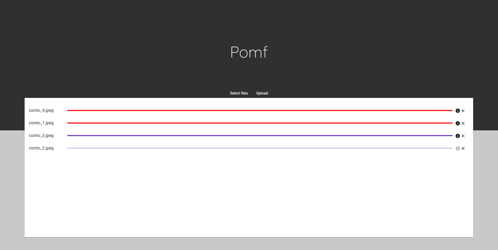

# Warkio Pomf

<br/>
<br/>
<br/>
Simple looking Angular 8 frontend for pomf clones.
## Install & Config

```sh
git clone https://github.com/warkio/Angular-pomf
cd Angular-pomf
npm install
cp src/environments/environment.ts src/environments/environment.prod.ts
# Change the info on the prod environment for you desired one

ng build --prod
```


## TODO
- Copy to clipboard